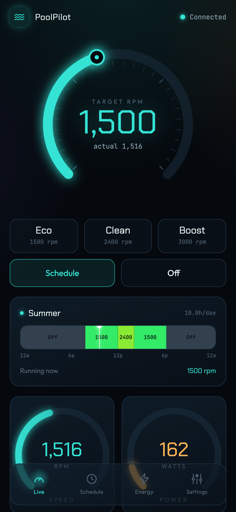
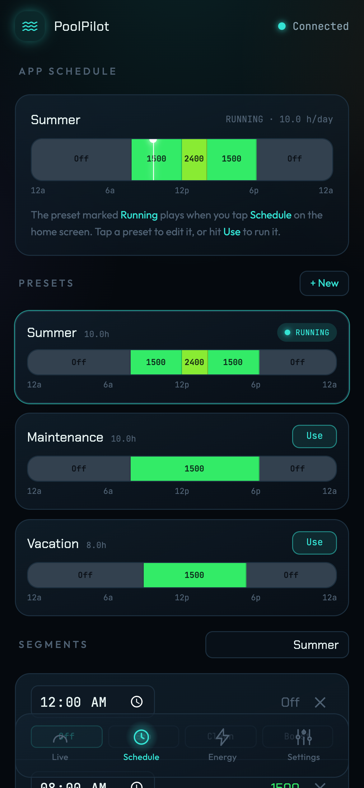
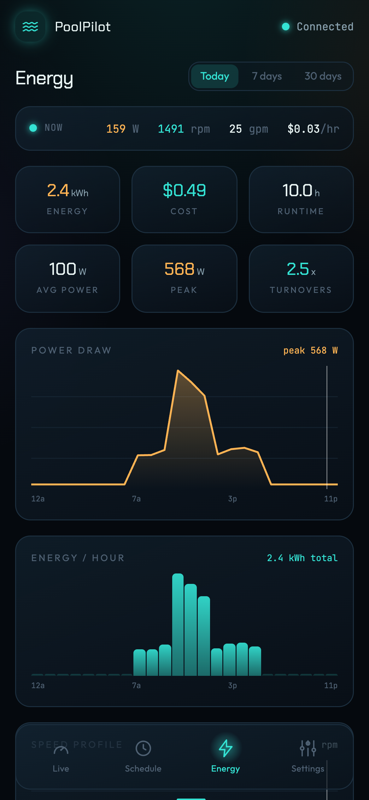
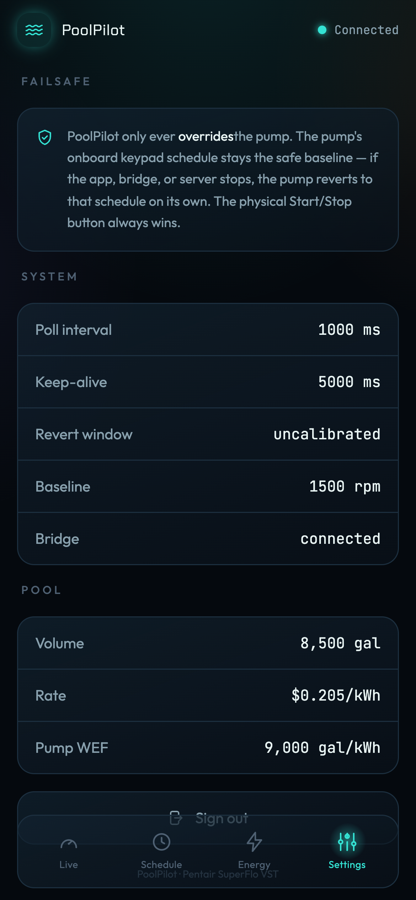
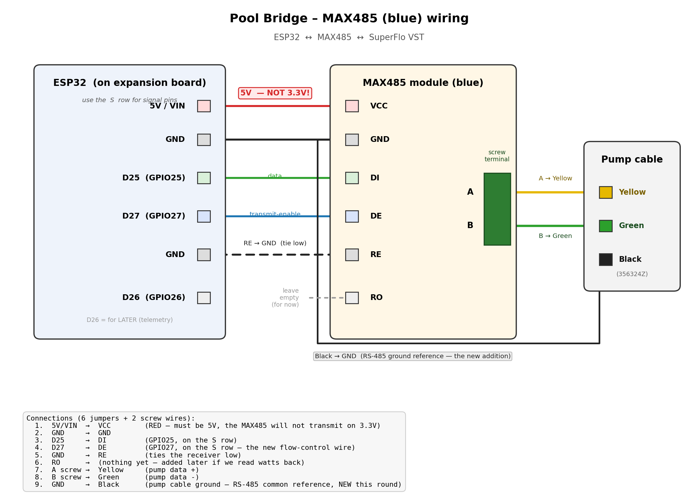

# PoolPilot

A self-hosted smart controller for a "dumb" pool pump. The **Pentair SuperFlo VST** is a great
variable-speed pump with no app, no WiFi, and no integration story — so I reverse-engineered its
RS-485 protocol, hand-wired an ESP32 bridge at the equipment pad, and built the app I wished
existed: real-time control, visual scheduling, and energy analytics with consumer-product polish.
It has run our family pool every day since it shipped.

<p align="center">
  
  
  
  
</p>

## How it works

```
 Pentair SuperFlo VST                                       T630 home server (Docker / Coolify)
┌──────────────────┐  RS-485  ┌────────────────┐  TCP  ┌───────────────┐  TCP  ┌─────────────────────────────────┐
│ pump @ addr 0x60 │◄────────►│ ESP32 + MAX485 │◄─────►│ pool-guardian │◄─────►│ pool-api · Fastify + Socket.IO  │
│ (9600 8N1)       │          │ bridge  :8899  │       │ failover proxy│       │ command queue · poller          │
└──────────────────┘          └────────────────┘       └───────────────┘       │ scheduler · keep-alive · watchdog│
                                                                               └────────┬───────────────┬────────┘
                                                                            REST + WS   │               │ SQL
                                                                               ┌────────▼────────┐ ┌────▼────────┐
                                                                               │ pool-web        │ │ pool-db     │
                                                                               │ Next.js PWA     │ │ TimescaleDB │
                                                                               └─────────────────┘ └─────────────┘
```

- **`pool-api`** is the single owner of the half-duplex RS-485 bus: a serialized command queue,
  a 1 Hz telemetry poller, a timezone-aware scheduler, a keep-alive engine that sustains overrides,
  and a watchdog. Auth is scrypt + HMAC session cookies with login rate-limiting.
- **`pool-guardian`** is a tiny failover proxy holding the one persistent connection to the ESP32.
  While the app is up it only relays bytes; if the app drops mid-run (e.g. a redeploy), it takes
  over the keep-alive with the last known setpoint so the pump never notices — then releases to
  the onboard schedule if the app stays gone. See [`apps/guardian`](apps/guardian/README.md).
- **`pool-web`** is a dark, mobile-first "instrument panel" — a thumb-driven radial RPM slider with
  haptics, glowing speed/power gauges, a 24-hour color-coded schedule timeline, and an energy page
  that translates telemetry into dollars, kWh, and water turnovers.
- **`pool-db`** (TimescaleDB) stores telemetry history for the charts; the app degrades gracefully
  to live-only mode without it.

## The failsafe (the design that matters most)

A pool pump must never end up silently stopped because a hobby app crashed. So PoolPilot only ever
**overrides** the pump:

- The pump's **onboard keypad schedule is the safe baseline.** The app never enters
  External-Control-Only mode (which would disable that schedule).
- App overrides are **transient**, sustained only by a keep-alive heartbeat. If the app, server,
  or bridge dies, the pump times out and reverts to its onboard schedule on its own.
- The physical Start/Stop button is the ultimate hardware gate.

## Try it without a pool (demo mode)

```bash
pnpm install
pnpm --filter @pool/web demo     # http://localhost:3000 — fully simulated pump, no hardware/API
```

Demo mode simulates live telemetry, schedules, and settings entirely client-side — it's the same
UI that runs in production.

```bash
pnpm -r test                     # protocol codec + scheduler/energy unit tests
```

## The hardware

A $20 aftermarket cable into the pump's comm port, an ESP32 running ESPHome as a transparent
WiFi↔RS-485 bridge, and a MAX485 transceiver. The hard-won lesson: "auto-direction" RS-485 modules
never reliably drove the transmit line — the fix was an explicit **flow-control pin** (DE on a GPIO,
toggled by the firmware around each write).



- Firmware config: [`docs/firmware/poolbridge.yaml`](docs/firmware/poolbridge.yaml)
  (ESPHome + [oxan/esphome-stream-server](https://github.com/oxan/esphome-stream-server))
- Protocol reference: [`docs/superflo-vst-rs485-reference.md`](docs/superflo-vst-rs485-reference.md) —
  the full reverse-engineered map of frames, telemetry, and command registers. Short version: the
  RS-485-capable SuperFlo VST impersonates an IntelliFlo VS on the wire, reports watts/RPM, and
  takes speed commands via register `0x02C4`.

## Monorepo layout

```
apps/
  api/        Node + TS service (Fastify + Socket.IO) — owns the bridge, runs the pump
  guardian/   failover keep-alive proxy between the app and the ESP32
  web/        Next.js PWA — dark mobile-first UI (Tailwind v4 + motion)
packages/
  protocol/   Pentair RS-485 codec (framing, checksum, command factories, status decode) + tests
  types/      shared Zod schemas / DTOs
docs/         protocol reference · wiring diagram · bridge firmware · screenshots · system notes
```

## Deploy

Docker Compose (three services behind Traefik with auto-SSL), deployed by
[Coolify](https://coolify.io) on a home server. Pushes to `main` trigger a rebuild via a
self-hosted GitHub Actions runner inside the network — the Coolify dashboard never has to be
exposed to the internet. See [`DEPLOY.md`](DEPLOY.md) for the runbook, secrets generation, and
the failsafe drills.

## Notes

- Built for one specific pump, but `@pool/protocol` should apply to any post-2020 SuperFlo VST
  (and largely to the IntelliFlo VS family it impersonates). Use at your own risk — a wrong frame
  on the bus is a bad day.
- Designed and built end-to-end by [Matt Hicks](https://digitalfish.io) with Claude Code as the
  engineering pair. There's a full case study at
  [digitalfish.io/case-study/poolpilot](https://digitalfish.io/case-study/poolpilot).

## License

[MIT](LICENSE)
